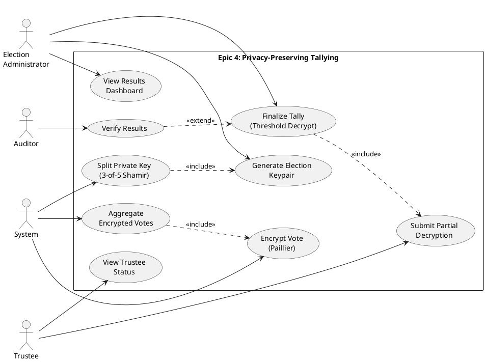
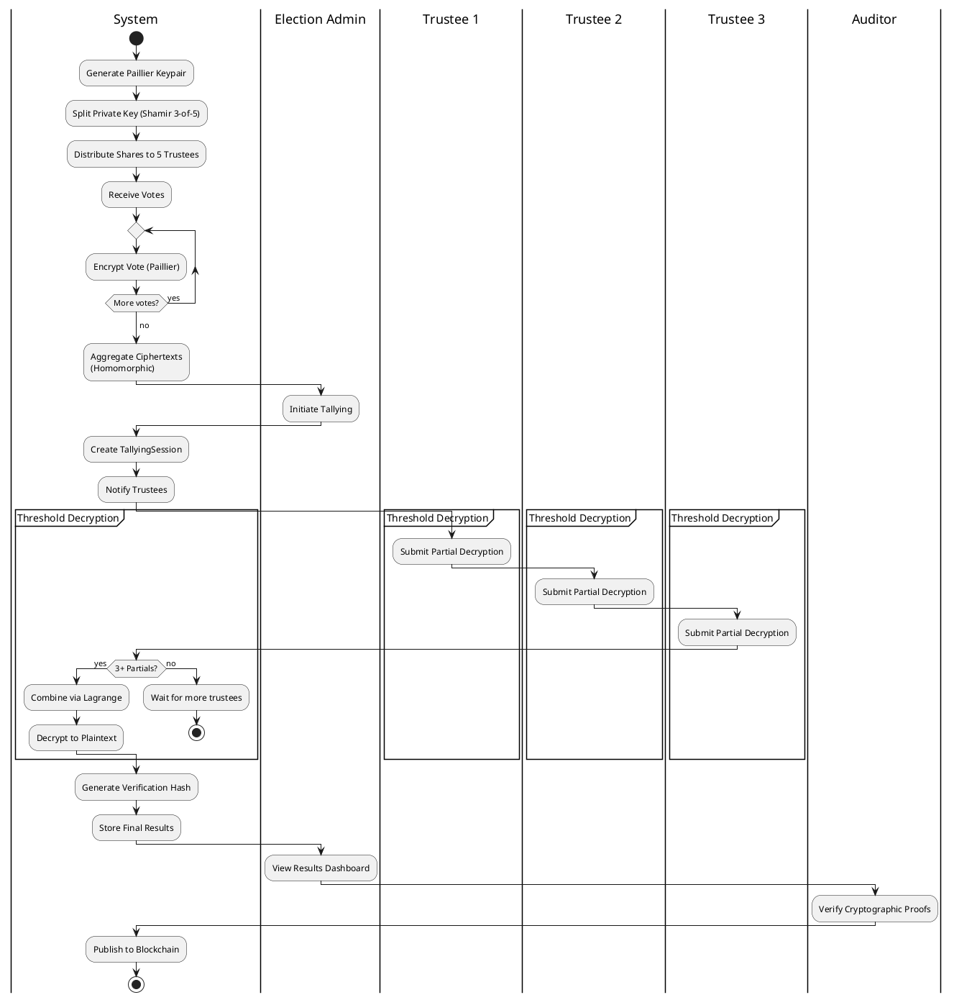
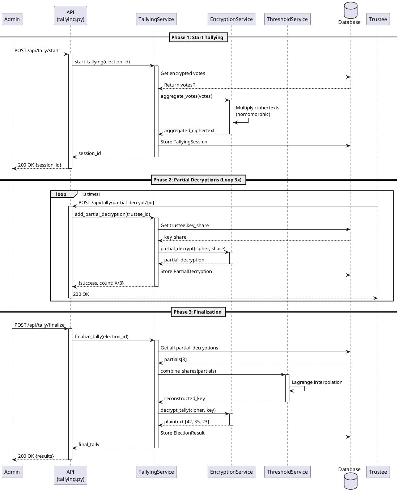
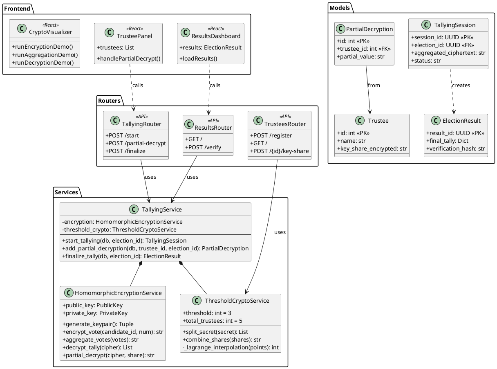

# Epic 4: UML Diagrams Specification
## Privacy-Preserving Tallying & Result Verification

**Author:** Kapil  
**Epic:** 4 - Privacy-Preserving Tallying  
**Date:** February 8, 2026

This document provides detailed specifications for creating UML diagrams for Epic 4. These diagrams can be rendered using PlantUML, Lucidchart, Draw.io, or similar tools.

---

## 1. Use Case Diagram

### Purpose
Show the interactions between actors (Election Admin, Trustee, System) and the privacy-preserving tallying system.

### Actors
1. **Election Administrator** - Manages the election lifecycle
2. **Trustee** (x5) - Key holders who participate in threshold decryption
3. **System** - Automated tallying service
4. **Auditor** - Verifies results

### Use Cases

#### Primary Use Cases
1. **Generate Election Keypair**
   - Actor: Election Administrator
   - Description: Create public/private key for election using Paillier
   - Precondition: Election created
   - Postcondition: Keypair stored, public key available

2. **Split Private Key**
   - Actor: System
   - Description: Split private key into 5 shares using Shamir (3-of-5)
   - Precondition: Keypair generated
   - Postcondition: Each trustee has one share

3. **Encrypt Vote**
   - Actor: System
   - Description: Encrypt ballot using homomorphic encryption
   - Precondition: Public key loaded
   - Postcondition: Ciphertext stored

4. **Aggregate Encrypted Votes**
   - Actor: System
   - Description: Combine ciphertexts homomorphically
   - Precondition: Multiple encrypted votes exist
   - Postcondition: Single aggregated ciphertext

5. **Submit Partial Decryption**
   - Actor: Trustee
   - Description: Provide partial decryption using key share
   - Precondition: Votes aggregated, trustee authenticated
   - Postcondition: Partial decryption stored

6. **Finalize Tally**
   - Actor: Election Administrator
   - Description: Combine 3+ partial decryptions to reveal result
   - Precondition: At least 3 trustees completed
   - Postcondition: Final plaintext tally available

7. **Verify Results**
   - Actor: Auditor
   - Description: Verify cryptographic proofs of correct tallying
   - Precondition: Results published
   - Postcondition: Verification status confirmed

#### Supporting Use Cases
- **View Trustee Status** - Check decryption progress (0/3 → 3/3)
- **View Results Dashboard** - See final vote distribution
- **View Audit Log** - Review all tallying operations
- **Visualize Crypto Process** - Educational demos

### Relationships
- **Include:** "Finalize Tally" includes "Submit Partial Decryption" (must happen 3+ times)
- **Extend:** "Verify Results" extends "Finalize Tally" (optional verification step)
- **Generalization:** All trustees inherit from "User" actor

### PlantUML Code


---

## 2. Activity Diagram

### Purpose
Show the complete workflow from vote encryption through threshold decryption to final result.

### Swimlanes
1. **System** - Automated processes
2. **Election Admin** - Human oversight
3. **Trustee 1, 2, 3** - Decryption participants

### Activity Flow

#### Phase 1: Vote Encryption & Aggregation
1. [System] Generate Paillier keypair (public, private)
2. [System] Split private key → 5 shares (Shamir)
3. [System] Distribute shares to trustees
4. [System] Receive plaintext votes
5. [System] For each vote:
   - Convert to vector [1,0,0] or [0,1,0] etc.
   - Encrypt with public key
   - Store ciphertext
6. [System] Aggregate all ciphertexts (homomorphic multiplication)
7. [System] Store aggregated ciphertext

#### Phase 2: Threshold Decryption
8. [Admin] Initiate tallying
9. [System] Create TallyingSession
10. [System] Notify all 5 trustees
11. **[Decision]** For each trustee:
    - [Trustee] Receive notification
    - [Trustee] Submit partial decryption
    - [System] Store partial decryption
    - [System] Check: Do we have 3+ partials?
      - **No:** Wait for more trustees
      - **Yes:** Proceed to finalization
12. [System] Combine 3+ partial decryptions (Lagrange interpolation)
13. [System] Decrypt to plaintext tally
14. [System] Generate verification hash
15. [System] Store final results

#### Phase 3: Verification & Publishing
16. [Admin] View results dashboard
17. [Auditor] Optionally verify cryptographic proofs
18. [System] Generate audit log
19. [System] Publish to blockchain (Epic 3)
20. **End**

### Decision Points
- **Threshold Check:** At least 3 partial decryptions?
- **Verification:** Audit results?

### PlantUML Code


---

## 3. Sequence Diagram

### Purpose
Show the detailed message flow between components during the tallying process.

### Participants
1. **Admin** - Election Administrator
2. **API** - FastAPI Backend (tallyingRouter)
3. **TallyingService** - Business logic
4. **EncryptionService** - Paillier operations
5. **ThresholdService** - Shamir operations
6. **Database** - PostgreSQL
7. **Trustee** - Key holder (x3)

### Sequence Flow

#### Scenario: Complete Tallying Workflow

1. Admin → API: POST /api/tally/start {election_id}
2. API → TallyingService: start_tallying(election_id)
3. TallyingService → Database: Get election votes
4. Database → TallyingService: Return encrypted votes
5. TallyingService → EncryptionService: aggregate_votes(votes[])
6. EncryptionService → EncryptionService: Multiply ciphertexts
7. EncryptionService → TallyingService: Return aggregated_ciphertext
8. TallyingService → Database: Store TallyingSession
9. TallyingService → API: Return session_id
10. API → Admin: 200 OK {session_id, status}

**[Trustee Loop - 3 times]**

11. Trustee → API: POST /api/tally/partial-decrypt/{trustee_id}
12. API → TallyingService: add_partial_decryption(trustee_id)
13. TallyingService → Database: Get trustee key_share
14. Database → TallyingService: Return key_share
15. TallyingService → EncryptionService: partial_decrypt(cipher, share)
16. EncryptionService → TallyingService: Return partial_decryption
17. TallyingService → Database: Store PartialDecryption
18. TallyingService → API: Return {success, count: X/3}
19. API → Trustee: 200 OK

**[After 3rd Trustee]**

20. Admin → API: POST /api/tally/finalize {election_id}
21. API → TallyingService: finalize_tally(election_id)
22. TallyingService → Database: Get all partial_decryptions
23. Database → TallyingService: Return partials[]
24. TallyingService → ThresholdService: combine_shares(partials)
25. ThresholdService → ThresholdService: Lagrange interpolation
26. ThresholdService → TallyingService: Return reconstructed_key
27. TallyingService → EncryptionService: decrypt_tally(cipher, key)
28. EncryptionService → TallyingService: Return plaintext [42, 35, 23]
29. TallyingService → Database: Store ElectionResult
30. TallyingService → API: Return final_tally
31. API → Admin: 200 OK {results, verification_hash}

### PlantUML Code


---

## 4. Class Diagram

### Purpose
Show the object-oriented structure of Epic 4 components including services, models, and routers.

### Classes

#### Service Layer

**1. HomomorphicEncryptionService**
```
+ public_key: PublicKey
+ private_key: PrivateKey
--
+ generate_keypair(): (str, str)
+ load_public_key(key: str): void
+ load_private_key(key: str): void
+ encrypt_vote(candidate_id: int, num_candidates: int): str
+ aggregate_votes(votes: List[str]): str
+ decrypt_tally(ciphertext: str): List[int]
+ partial_decrypt(ciphertext: str, share: str): str
```

**2. ThresholdCryptoService**
```
+ threshold: int = 3
+ total_trustees: int = 5
--
+ split_secret(secret: str): List[Dict]
+ combine_shares(shares: List[Dict]): str
+ _generate_polynomial(secret: int, degree: int): List[int]
+ _evaluate_polynomial(coeffs: List[int], x: int): int
+ _lagrange_interpolation(points: List[Tuple]): int
```

**3. TallyingService**
```
+ encryption: HomomorphicEncryptionService
+ threshold_crypto: ThresholdCryptoService
--
+ start_tallying(db: Session, election_id: UUID): TallyingSession
+ add_partial_decryption(db: Session, trustee_id: int, election_id: UUID): PartialDecryption
+ finalize_tally(db: Session, election_id: UUID): ElectionResult
+ get_tally_status(db: Session, election_id: UUID): Dict
```

#### Model Layer

**4. Trustee (Database Model)**
```
+ id: int [PK]
+ name: str
+ email: str
+ public_key: str
+ key_share_encrypted: str
+ created_at: datetime
```

**5. TallyingSession (Database Model)**
```
+ session_id: UUID [PK]
+ election_id: UUID [FK]
+ aggregated_ciphertext: str
+ status: str
+ started_at: datetime
+ completed_at: datetime
+ required_trustees: int = 3
```

**6. PartialDecryption (Database Model)**
```
+ id: int [PK]
+ election_id: UUID [FK]
+ trustee_id: int [FK]
+ partial_value: str
+ computed_at: datetime
```

**7. ElectionResult (Database Model)**
```
+ result_id: UUID [PK]
+ election_id: UUID [FK]
+ final_tally: Dict[str, int]
+ total_votes_tallied: int
+ verification_hash: str
+ is_verified: bool
+ published_at: datetime
```

#### Router Layer

**8. TallyingRouter**
```
--
+ start_tally(election_id: UUID): TallyStartResponse
+ partial_decrypt(trustee_id: int, election_id: UUID): PartialDecryptResponse
+ finalize(election_id: UUID): TallyFinalizeResponse
+ get_status(election_id: UUID): TallyStatusResponse
```

**9. TrusteesRouter**
```
--
+ register(data: TrusteeRegisterRequest): TrusteeResponse
+ get_all(): List[TrusteeResponse]
+ get_by_id(trustee_id: int): TrusteeResponse
+ generate_key_share(trustee_id: int): KeyShareResponse
```

**10. ResultsRouter**
```
--
+ get_all(): List[ElectionResultResponse]
+ get_by_election(election_id: UUID): ElectionResultResponse
+ verify(election_id: UUID): ResultVerificationResponse
+ get_audit_log(election_id: UUID): List[AuditLogResponse]
```

#### Frontend Components

**11. TrusteePanel (React Component)**
```
+ trustees: List[Trustee]
+ tallyStatus: TallyStatus
+ loading: Dict[int, bool]
--
+ loadTrustees(): void
+ handlePartialDecrypt(trustee_id: int): void
+ render(): JSX.Element
```

**12. ResultsDashboard (React Component)**
```
+ results: ElectionResult
+ stats: StatsData
--
+ loadResults(): void
+ loadStats(): void
+ render(): JSX.Element
```

**13. CryptoVisualizer (React Component)**
```
+ activeDemo: str
+ votes: List[Vote]
+ encryptedVotes: List[EncryptedVote]
+ aggregatedVote: AggregatedVote
+ partialDecryptions: List[Partial]
+ finalResult: Dict
--
+ runEncryptionDemo(): void
+ runAggregationDemo(): void
+ runDecryptionDemo(): void
+ resetDemo(): void
+ render(): JSX.Element
```

### Relationships

**Composition:**
- `TallyingService` ◆→ `HomomorphicEncryptionService`
- `TallyingService` ◆→ `ThresholdCryptoService`

**Association:**
- `TallyingRouter` → `TallyingService` (uses)
- `TrusteesRouter` → `ThresholdCryptoService` (uses)
- `TallyingSession` → `Election` (belongs to)
- `PartialDecryption` → `Trustee` (from)
- `ElectionResult` → `Election` (for)

**Dependency:**
- All routers depend on `Session` (database)
- Frontend components depend on `api.js` service

### PlantUML Code


---

## 5. Component Diagram (Optional)

### Purpose
Show the high-level architecture of Epic 4 components and their dependencies.

### Components
1. **Frontend Layer** (React)
   - TrusteePanel
   - ResultsDashboard
   - CryptoVisualizer

2. **API Layer** (FastAPI Routers)
   - trustees.py
   - tallying.py
   - results.py

3. **Service Layer** (Business Logic)
   - encryption.py
   - threshold_crypto.py
   - tallying.py

4. **Data Layer** (PostgreSQL)
   - Trustee table
   - TallyingSession table
   - PartialDecryption table
   - ElectionResult table

### Dependencies
- Frontend → API (HTTP/REST)
- API → Services (Python imports)
- Services → Database (SQLAlchemy ORM)
- Services → phe library (Paillier crypto)

---

## 6. Deployment Diagram (Optional)

### Purpose
Show how Epic 4 components are deployed in Docker containers.

### Nodes
1. **Frontend Container** (Node.js)
   - React app on port 3000
   - Proxies API calls to backend:8000

2. **Backend Container** (Python)
   - FastAPI on port 8000
   - Services and routers
   - Connects to postgres:5432

3. **PostgreSQL Container**
   - Port 5432
   - Stores all models

4. **Redis Container** (Optional)
   - Port 6379
   - Caching layer

---

## Rendering Instructions

### Tools
1. **PlantUML:** Copy code blocks into [PlantText](https://www.planttext.com/) or local PlantUML
2. **Lucidchart:** Manually create from specifications
3. **Draw.io:** Import PlantUML or create manually
4. **Mermaid:** Convert PlantUML to Mermaid.js syntax

### Export Formats
- PNG (for documentation)
- SVG (for scalability)
- PDF (for presentations)

---

**Document Version:** 1.0  
**Last Updated:** February 8, 2026  
**Author:** Kapil - Epic 4 Owner
